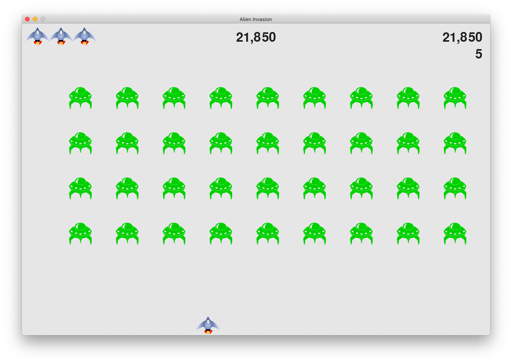

# Alien Invasion

This game is written in Python 3 and uses the [pygame](pygame.org) module. The game is a project in the book [Python Crash Course (2nd Edition)](https://ehmatthes.github.io/pcc_2e/).

### Screenshot

#### Start screen:

#### Game play:

### Dependencies
- [Python 3.7](https://www.python.org/)
- [pygame](pygame.org)